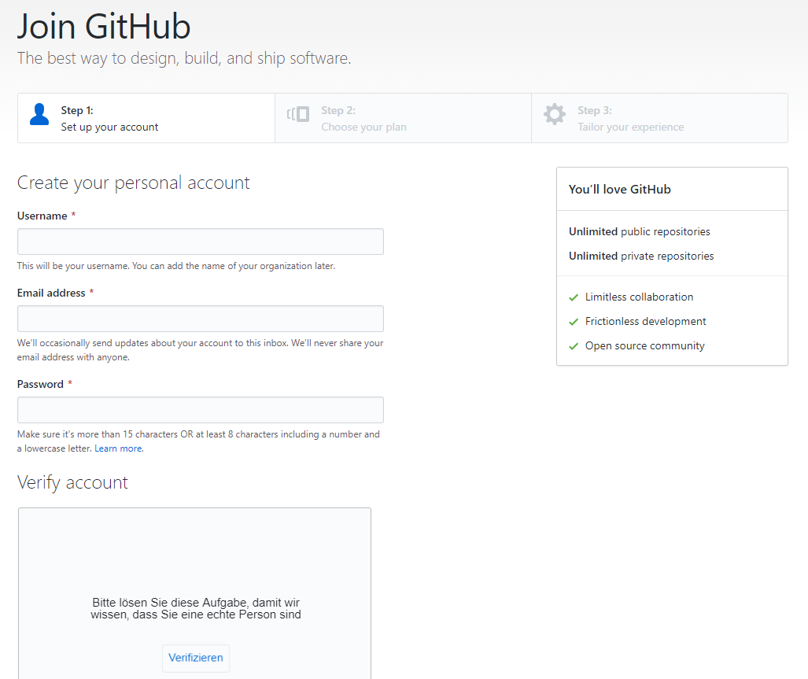
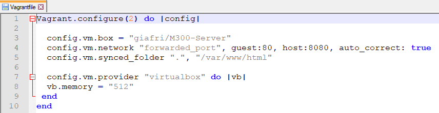
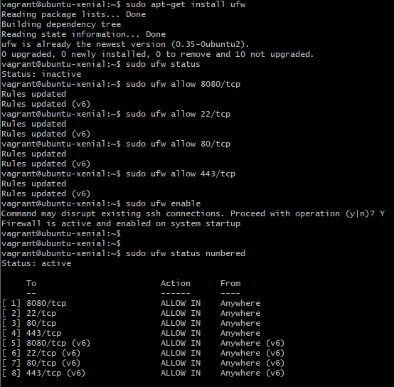
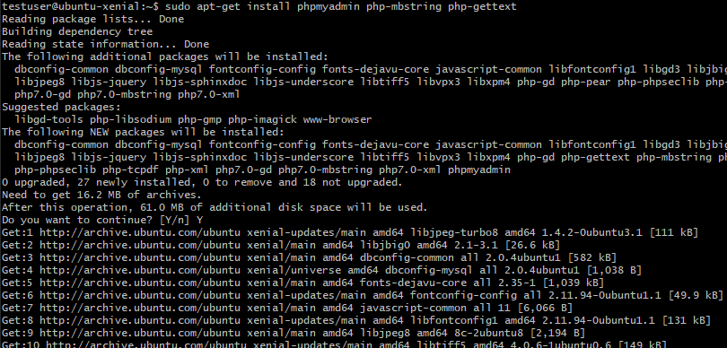

# Modul 300 Dokumentation
## Inhaltsverzeichnis

1. Login
2. Git
   1. Git-Hub Account erstellen
3. Web-Server Installation mit Vagrant
   1. Vagrantfile
   2. Neuer Sudo User erstellen
      1. Sudo User Testen
   3. Firewall Regeln
   4. SSH Key erstellen
   5. MySQL - PhP - PhPMyAdmin installation
4. Vagrant Box Release
5. Vergleich Vorwissen - Wissenszuwachs
   1. Was ich zuvor gewusst habe
   2. Was ich daraus gelernt habe
6. Reflexion

# Login
Das Login auf allen VMs erfolgt mit folgendem Passwort. Der Username hängt vom Account ab...

Benutzername: __<<username>username>__

Passwort: __Modul300*__

# Git
## Git-Hub Account erstellen
Als erstes besucht man die Webseite https://github.com/. Anschliessend wählt man oben rechts das Feld *Sign Up*. Wenn das getan ist, kann man nun seine Daten eingeben und einen Account für Git-Hub erstellen.

# Web-Server Installation mit Vagrant
## Vagrantfile
Das Vagrantfile dient der Konfiguration der VM, bevor man sie das erste Mal aufstartet.

## Neuer Sudo User erstellen
Um das Usererstellen auszuprobieren habe ich einen neue Sudo User erstellt. Dies ging ganz einfach mit dem Command *sudo adduser m300admin*. "m300admin" ist dabei der Username. Anschliessend wird man noch nach einem Passwort gefragt. Dabei habe ich wieder dasselbe verwendet wie immer.

Anschliessend benötigt der neue erstellte User noch die Berechtigungen um die Rolle als SuperUser zu erfüllen. Dies gint mit dem Command *sudo usermod -aG sudo testuser*

### Sudo User testen

Um zu überprüfen, dass der neu erstellte User auch die richtigen Berechtigunen hat, habe ich mich auf ihm eingeloggt. Ganz einfach mit dem Befehl *su - testuser*. Und dann auf dem neuen Benutzer ein Befehl mit *sudo* ausgeführt. In diesem Fall habe ich die nummerierte Firewall-Regel Tabelle abgerufen. Weiter unten (im Bild) sieht man, dass der Befehl ohne *sudo* nicht funktioniert.

## Firewall Regeln

Ich habe mich für folgende Firewall Regeln entschieden. Diese hatten keinen besonderen Grund, einfach, dass ich beim installieren auf keine Probleme stosse.

## SSH Key erstellen

Mit folgendem Befehl habe ich einen SSH Key erstellt um den abgesicherten SSH Zugriff zu sichern.

## MySQL - PhP - PhPMyAdmin installation
MySQL installieren.

PhP installieren.

phpmyadmin installieren.

Damit die index.php Seite über dem Apache2-Index priorisiert wird, muss man das dir.conf File so anpassen, dass in der zweiten Zeile index.php vor index.html vorkommt.

Als letztes muss man noch die phpmyadmin mods installieren.

# Vagrant Box release

Nachdem alle Services auf dem Server installiert wurden kann man mithilfe des commands *vagrand packet --output <<boxname>boxname>.box* die im aktuellen Verzeichnis laufende VM packetieren und ein .box File erstellen. 

Anschliessend muss man sich bei https://vagrantcloud.com anmelden und den Button "Create a new Vagrant Box" anwählen. Darin folgt man den einzelnen Schritten. Beim Feld "Provider" wählt man "virtualbox" aus, da alles auf dieser Software aufgesetzt wurde. Anschliessend kann man das eben erstellte .box File hochladen und die Vagrant Box Releasen.

# Vergleich Vorwissen - Wissenszuwachs
## Was ich zuvor gewusst habe
Vor dem Modul hatte ich gerade Mal eine grundlegende Anhung was Virtualisiert anbelangt. Ich wusste wie man Virtuelle Maschinen aufbaut, was Cloud Services sind und ein wenig über Containerisierung.

Jedoch hatte ich noch nie von Vagrant gehört, deshalb war alles, was die Konfiguartion angeht neu für mich.

## Was ich darauch gelernt habe
Ich konnte in diesem Projekt Vagrant sehr gut kennenlernen, und damit arbeiten. Ich hätte jedoch nicht so viel Zeit damit verschwenden sollen, da ich am Ende nicht mehr viel Zeit für die LB3 hatte.

# Reflexion
Da ich persönlich noch nie mit Vagrant oder Virtual Box gearbeitet habe, war alles neu für mich. Dass die einzelnen Arbeitsschritte grösstenteils bereits Dokumentiert waren, hat mir sehr geholfen.

Womit ich jedoch schwierigkeiten hatte, war der Auftrag selbst. Mir, und warscheinlich auch anderen aus meiner Klasse, war nicht klar was am Ende dieser LB Ziel war. 

Weiter stand ich lange an der Konfiguration bzw. Automatisierung der VMs an. Ich verstand anfangs nicht wie, wo und was.

Schlussendlich fand ich dieses Projekt sehr Interessant und ich habe sehr viel neues Dazugelernt und ich konnte meine Linux-Skills wieder einmal auffrischen.