# Modul 300 Dokumentation
## Inhaltsverzeichnis

1. Login
2. Git
   1. Git-Hub Account erstellen
3. Web-Server Installation mit Vagrant
   1. Vagrantfile
   2. Neuer Sudo User erstellen
      1. Sudo User Testen
   3. Firewall Regeln
   4. SSH Key erstellen
   5. MySQL, PhP und PhPMyAdmin Installation
4. Vagrant Box Release
5. Docker
   1. Dockerfile
6. LAMP Stack mit Docker-Compose
   1. Vorbereitungen
   2. Konfiguration der docker-compose Datei
   3. Erstellen des Dockerfiles
   4. Der letze Schritt
   5. Sicherheitsmassnahmen
   6. Tests
      1. Testfall 1
      2. Testfall 2
      3. Testfall 3
7. Vergleich Vorwissen und Wissenszuwachs
   1. Vorwissen
   2. Wissenszuwachs
8.  Reflexion

# Login
Das Login auf allen VMs erfolgt mit folgendem Passwort. Der Username hängt vom Account ab...

Benutzername: __<<username>username>__

Passwort: __Modul300*__

# Git
## Git-Hub Account erstellen
Als erstes besucht man die Webseite https://github.com/. Anschliessend wählt man oben rechts das Feld *Sign Up*. Wenn das getan ist, kann man nun seine Daten eingeben und einen Account für Git-Hub erstellen.

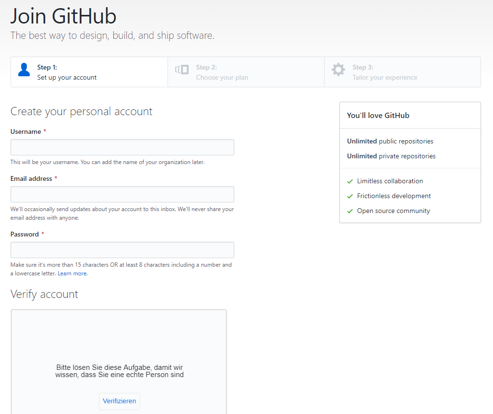

# Web-Server Installation mit Vagrant
## Vagrantfile
Das Vagrantfile dient der Konfiguration der VM, bevor man sie das erste Mal aufstartet.

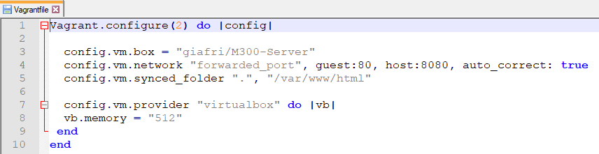

## Neuer Sudo User erstellen
Um das Usererstellen auszuprobieren habe ich einen neue Sudo User erstellt. Dies ging ganz einfach mit dem Kommando `sudo adduser m300admin`. "m300admin" ist dabei der Username. Anschliessend wird man noch nach einem Passwort gefragt. Dabei habe ich wieder dasselbe verwendet wie immer.

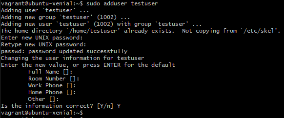

Anschliessend benötigt der neue erstellte User noch die Berechtigungen um die Rolle als SuperUser zu erfüllen. Dies gint mit dem Kommando `sudo usermod -aG sudo testuser`

### Sudo User testen

Um zu überprüfen, dass der neu erstellte User auch die richtigen Berechtigunen hat, habe ich mich auf ihm eingeloggt. Ganz einfach mit dem Befehl `su - testuser`. Und dann auf dem neuen Benutzer ein Befehl mit `sudo` ausgeführt. In diesem Fall habe ich die nummerierte Firewall-Regel Tabelle abgerufen. Weiter unten (im Bild) sieht man, dass der Befehl ohne `sudo` nicht funktioniert.

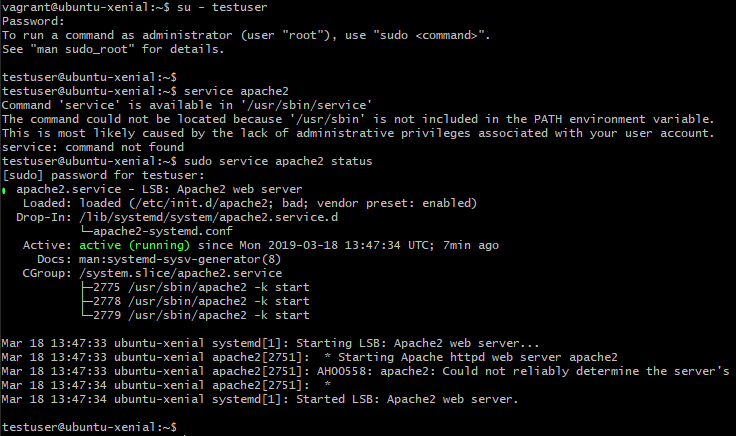

## Firewall Regeln

Ich habe mich für folgende Firewall Regeln entschieden. Diese hatten keinen besonderen Grund, einfach, dass ich beim installieren auf keine Probleme stosse.

## SSH Key erstellen

Mit folgendem Befehl habe ich einen SSH Key erstellt um den abgesicherten SSH Zugriff zu sichern.

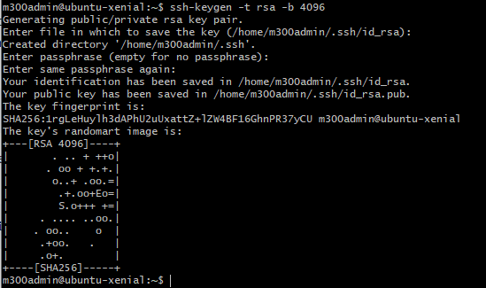

## MySQL, PhP und PhPMyAdmin Installation
MySQL installieren.

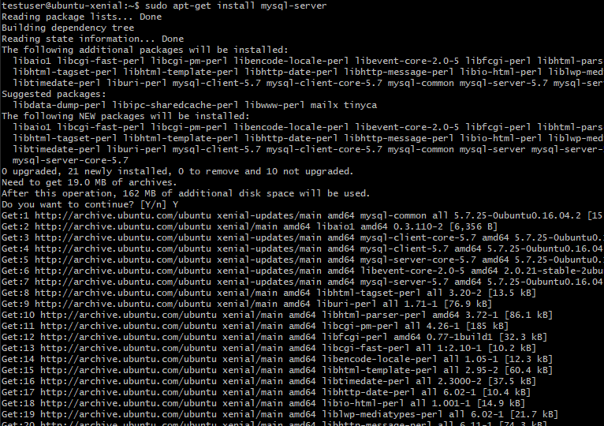

PhP installieren.

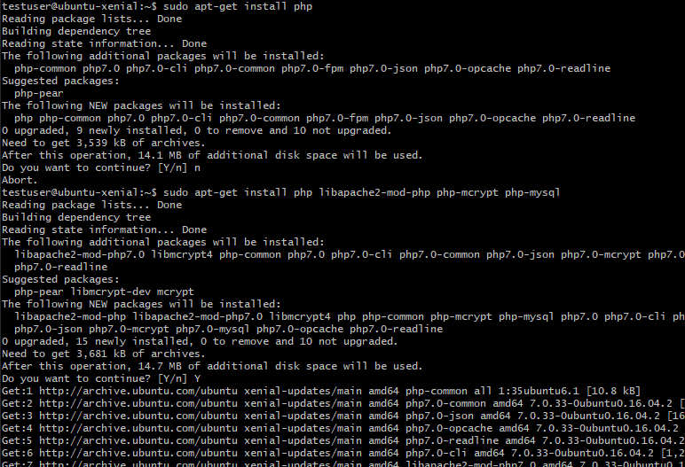

phpmyadmin installieren.

Damit die index.php Seite über dem Apache2-Index priorisiert wird, muss man das dir.conf File so anpassen, dass in der zweiten Zeile index.php vor index.html vorkommt.

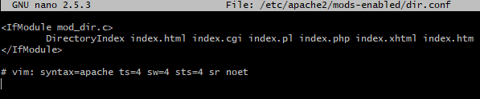

Als letztes muss man noch die phpmyadmin mods installieren.

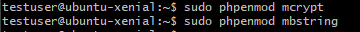

# Vagrant Box Release

Nachdem alle Services auf dem Server installiert wurden kann man mithilfe des commands `vagrand packet --output <boxname>.box` die im aktuellen Verzeichnis laufende VM packetieren und ein .box File erstellen. 

Anschliessend muss man sich bei https://vagrantcloud.com anmelden und den Button "Create a new Vagrant Box" anwählen. Darin folgt man den einzelnen Schritten. Beim Feld "Provider" wählt man "virtualbox" aus, da alles auf dieser Software aufgesetzt wurde. Anschliessend kann man das eben erstellte .box File hochladen und die Vagrant Box Releasen.

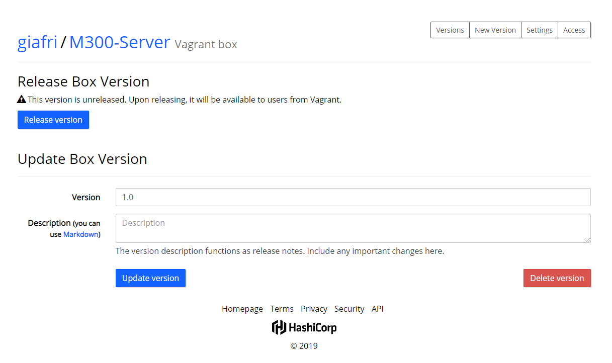

# Docker
Docker ist ein Programm, das für die Containerisierung genutzt wird. Wenn man das Docker paket herunterlädt bekommt man man einige Features mitinstalliert die man ebenfalls nutzen kann. Docker liefert ein ganzes Set an neuen Kommandos die man sowohl auf der Kommandozeile als auch in Skripts und im Dockerfile nutzen kann. Es hat sehr viele Ähnlichkeiten zu Vagrant. Der grosse unterschied ist nur, dass Vagrant zur Virtualisierung genutzt wird.

## Dockerfile
Das Dockerfile ist wie das Vagrantfile, eine Datei in der alle Konfigurationen die ein Container vorab haben soll wenn er aufgesetzt wird. Dies ermöglicht ein schnelles, felxibles wiederaufabauen von Conainern.

# LAMP Stack mit Docker-Compose
## Vorbereitungen
Um Später mit dem eigentlichen Aufsetzen des Containers beginnen zu können müssen wir zwei kleine Vorbereitungen treffen. Als erstes die Docker pakete installieren,
`apt-get install docker docker-compose` ``

Anschliessend müssen wir noch eins, zwei Verzeichnisse erstellen in denen wir unsere Konfigurationen speichern. Ich habe mich für das home-directory des roots entschieden. Es kommt aber nicht wirklich darauf an wo man dies tut.
`mkdir docker`. Nun, da wir einen LAMP Stack aufbauen brauchen wir noch ein Verzeichnis in dem wir die Startseite von unserem Apache speichern. Das habe ich im neuen /docker Verzeichnis gemacht. `mkdir documentroot`. Darin erstellen wir gleich eine index.php Datei mit dem Inhalt `<?php phpinfo(); ?>` um die Standardseite von PHP anzeigen zu lassen wenn wir im Browser auf unseren Container gehen. Danach brauchen wir noch eine .yml Datei in dem wir die docker-compose Konfigurationen speichern. Also direkt im /docker Verzeichnis `touch docker-compose.yml`. Diese Datei können wir nun mit unserem lieblings Editor bearbeiten.

## Konfiguration der docker-compose Datei
In dieser Datei setzen wir nun alle Komnfigurationen fest die wir haben wollen. Am ende sieht diese datei so aus (Achtung! Da diese Datei die YAML Syntax nutzt, muss man auf Zeilenumbrüche und Einschläge besonders acht geben!):

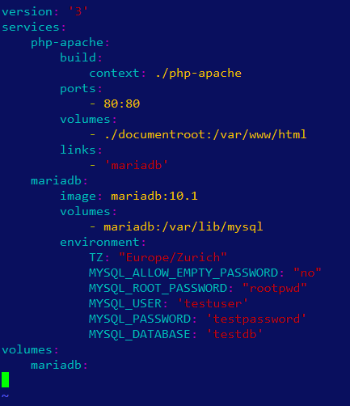

In der ersten Zeile geben wir die Version der docker-compose syntax an. Anschliessend definieren wir alle unsere Services unter `services:`. 

Es beginnt mit dem ersten Abschnitt. Darin ist der Name unseres ersten Services entalten, also `php-apache:`. Danach, woher wir das Image beziehen, also eine Datei im Verzeichnis /php-apache (Dazu später mehr!). Dann welche ports wir freigeben. Hier ist es Port 80 sowie auf dem Host als auch auf dem Container. Anschliessend welches Volume wir mounten möchten. Und zum Schluss des ersten Abschnitts, mit welchem Container wir diesen verlinken wollen.

Im nächsten Abschnitt beschreiben wir unseren Datenbank container. Dabei wird zu erst wieder der Name angegeben. Und als zweites das Image welches wir beziehen. `mariadb:10.1`. Unter `environment:` geben wir der docker-compose.yml Datei mit, welche Konfigurationen während der Installation unseres Datenbank-Containers getroffen werden sollen.

Und zum Schluss müssen noch ein sogenanntes "named volume" erstellen. Dies tun wir mit der Option `volumes:` ganz am Ende der Datei. 

## Erstellen des Dockerfiles
Nun brauchen wir noch Dockerfile um später auch die Container richtig aufbauen zu können. Wir erstellen nochmals ein neues Verzeichnis in /docker namens php-apache `mkdir php-apache`. Und darin kommt dann das Dockerfile. `touch Dockerfile`. Da wir aber schon einige Konfigurationen im docker-compose.yml angegeben haben wird diese Datei etwas kürzer.

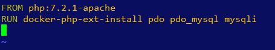

Daring geben wir an welches Image wir nutzen, in unserem Fall ist das php:7.2.1-apache. Und anschliessend geben wir noch an, welche Erweiterungen wir dazu haben wollen.

## Der letzte Schritt
Nun, da wir alle Konfigurationen gemacht haben, können wir die Container starten. `docker-compose up`. Dabei darauf achten, dass wir im gleichen Verzeichnis sind, wie die docker-compose.yml Datei.

Wenn alles korrekt läuft, sehen wir nun folgende Seite, wenn wir im Browser auf unseren Server gehen.

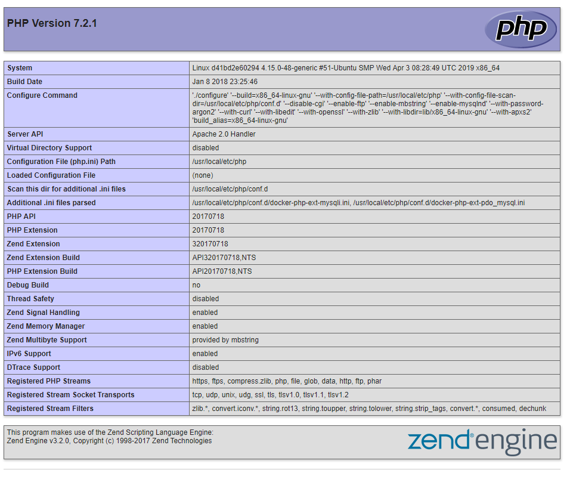

## Sicherheitsmassnahmen
###  Überwachung
Nachdem die Container aufgestartet wurden, wird alles was auf dem Server passiert live überwacht. 

## Tests
### Testfall 1
__Titel:__ Start der Container

__Datum:__ 3.5.19

__Beschreibung:__ Die Container werden gestartet.

__Erwartetes Ergebnis:__ Die Erwartung ist, dass verschiedene Container erstellt werden.

__Eigenliches Ergebnis:__ Es sind zwei verschiedene Container erstellt worden. Einer mit dem Namen "docker_mariadb_1" und einer namens "docker_php-apache_1".

### Testfall 2
__Titel:__ PHP Index Seite

__Datum:__ 3.5.19

__Beschreibung:__ Verbindung auf Server via Browser.

__Erwartetes Ergebnis:__ Erfolgreiches Erreichen der Seite des Servers. Es sollte die PHP Index Seite angezeigt werden.

__Eigenliches Ergebnis:__ Erfolgreich auf die Seite gekommen. Bei verändern der index.php Datei hat sich auch direkt die Seit im Browser verändert.

### Testfall 3
__Titel:__ Überwachung

__Datum:__ 3.5.19

__Beschreibung:__ Verbindung auf Server via Browser und Überprüfung der Überwachung.

__Erwartetes Ergebnis:__ Eintrag in der Konsole, dass um diese Zeit ein Benutzer diese Seite aufgerufen hat. Mit dem Browser Google Chrome auf Windows.

__Eigenliches Ergebnis:__ Test war erfolgreich. Folgende Zeile wurde in der Konsole ausgegeben. `php-apache_1  | 212.203.120.1 - - [03/May/2019:11:02:45 +0000] "GET / HTTP/1.1" 200 23807 "-" "Mozilla/5.0 (Windows NT 10.0; Win64; x64) AppleWebKit/537.36 (KHTML, like Gecko) Chrome/73.0.3683.103 Safari/537.36"`.

# Vergleich Vorwissen und Wissenszuwachs
## Vorwissen
Vor dem Modul hatte ich gerade Mal eine grundlegende Anhung was Virtualisierung anbelangt. Ich wusste wie man Virtuelle Maschinen aufbaut, was Cloud Services sind und ein wenig über Containerisierung.

Jedoch hatte ich noch nie von Vagrant oder Docker gehört, deshalb war alles, was die Konfiguartion angeht neu für mich.

## Wissenszuwachs
Ich konnte in diesem Projekt Vagrant sehr gut kennenlernen, und damit arbeiten. Ich hätte jedoch nicht so viel Zeit damit verschwenden sollen, da ich am Ende nicht mehr viel Zeit für die LB3 hatte. 

In der LB3 konnte ich mein Wissen in Docker sehr erweitern, da dies ebenfalls Neuland für mich war.

# Reflexion
Da ich persönlich noch nie mit Vagrant oder Docker gearbeitet habe, war alles neu für mich. Dass die einzelnen Arbeitsschritte grösstenteils bereits Dokumentiert waren, hat mir sehr geholfen.

Womit ich jedoch schwierigkeiten hatte, war der Auftrag selbst. Mir, und warscheinlich auch anderen aus meiner Klasse, war nicht klar was am Ende dieser LBs das Ziel war. 

Weiter stand ich lange an der Konfiguration bzw. Automatisierung der VMs an. Ich verstand anfangs nicht wie, wo und was.

Schlussendlich fand ich dieses Projekt sehr Interessant und ich habe sehr viel neues dazugelernt und ich konnte meine Fähigkeiten in Linux wieder einmal auffrischen.